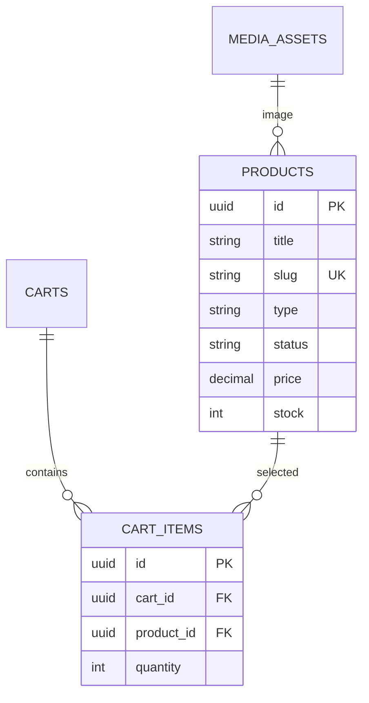

# Planning Backend API — Cart Items

Status: **Approved** — Docker-native, Gateway-ready
Version: 2.0.0 | Depends on: `carts-api.md` v2 | Stack: Laravel 13 + MySQL 8.4 + Docker Compose Watch

## 1. Tujuan & Batasan

Mutasi **satu-satunya** untuk mengubah `carts`. Semua perubahan `cart_items` harus lewat 3 endpoint ini; tidak ada `PUT /cart` atau bulk update di MVP.

**Batasan gateway-ready:**
- Tidak boleh menerima `cart_id` dari client — selalu resolve `currentCart = CartService::getCurrentCart(auth()->user())` lalu scope `cart_items` ke cart tersebut. Ini mencegah IDOR dan memastikan checkout selalu dari cart yang benar.
- Tidak boleh menerima `price`/`total` dari client — hitung `line_total = product.price * quantity` server-side.
- Product `digital` vs `physical` punya policy stok berbeda (lihat §3).

Schema: `2026_06_25_100019_create_cart_items_table`
```php
cart_items: id UUID PK, cart_id FK -> carts CASCADE, product_id FK -> products CASCADE, quantity INT default 1, timestamps
products: id, category_id, image_id, title, slug, type(digital|physical), status(active|inactive), price decimal 15,2, stock INT, is_featured, sold_count, digital_file_url
```

## 2. Visualisasi



## 3. Kebijakan Domain (Lock sebelum code)

| Aturan | Digital | Physical |
|---|---|---|
| **Validasi status** | `product.status must === active` — reject 409 jika inactive | Same |
| **Validasi stok** | **TIDAK** cek `stock` — digital unlimited, tapi cek `is_active` | `existing_qty + new_qty <= product.stock` — reject 409 jika kurang |
| **Quantity** | `1..99` per add, max per item `99` (anti abuse) | Same |
| **Merge vs duplicate** | `POST` product yang sudah ada di cart → **merge** `quantity += new` (bukan insert duplikat) — butuh `UNIQUE(cart_id,product_id)` | Same |
| **Update** | `PATCH quantity` replace (bukan add), `0` → 422 (pakai DELETE) | Same |
| **Harga** | Freeze hanya saat `POST /api/orders` — cart selalu baca harga live | Same |

**Kenapa digital unlimited?** `products.stock` untuk digital adalah placeholder; decrement stok digital tidak dilakukan. Jika ke depan ada `license_quota`, tambah kolom `digital_stock` terpisah.

## 4. Perubahan Schema (Docker)

```bash
# Sudah di carts-api.md — satu migration untuk keduanya
docker compose exec app php artisan make:migration add_unique_to_cart_items --table=cart_items
# up(): $table->unique(['cart_id','product_id'], 'cart_items_cart_product_unique');
docker compose exec app php artisan migrate
docker compose exec mysql mysql -u180dc -p180dc -e "SHOW CREATE TABLE cart_items;" 180dc
```

Tanpa unique, `POST /cart/items` 2x paralel bisa bikin 2 rows product sama.

## 5. Endpoint

Base: `/api/cart/items` — group `auth:sanctum`

| Method | Path | Akses | Tujuan | Body |
|---|---|---|---|---|
| `POST` | `/api/cart/items` | User | Add product; jika ada → merge quantity | `{product_id, quantity}` |
| `PATCH` | `/api/cart/items/{cartItem}` | User (owner) | Set quantity baru | `{quantity}` |
| `DELETE` | `/api/cart/items/{cartItem}` | User (owner) | Hapus 1 item | — |

**Tidak ada** `GET /api/cart/items` di MVP — pakai `GET /api/cart` yang sudah include `items`. Jika butuh untuk mobile, tambah sebagai alias read-only tanpa logic baru.

### 5.1 POST /api/cart/items — Add / Merge

**Request:**
```json
{
  "product_id": "0196a1b2-...",
  "quantity": 2
}
```
Rules `AddCartItemRequest`:
```php
'product_id' => ['required','uuid','exists:products,id'],
'quantity'   => ['required','integer','min:1','max:99'],
```

**Logic `CartItemService::add(User $user, string $productId, int $qty)` (pseudo):**
```php
return DB::transaction(function () use ($user,$productId,$qty) {
    $cart = $this->cartService->getCurrentCart($user);
    $product = Product::lockForUpdate()->findOrFail($productId);
    if ($product->status !== 'active') throw new ConflictException('Product not available');
    if ($product->type === 'physical' && $product->stock === 0) throw new ConflictException('Out of stock');

    $item = CartItem::where(['cart_id'=>$cart->id,'product_id'=>$productId])->lockForUpdate()->first();
    $newQty = $item ? $item->quantity + $qty : $qty;
    if ($product->type === 'physical' && $newQty > $product->stock) throw new ConflictException("Only {$product->stock} available");
    if ($newQty > 99) throw new ValidationException('Max 99 per item');

    if ($item) { $item->update(['quantity'=>$newQty]); } 
    else { $item = CartItem::create(['cart_id'=>$cart->id,'product_id'=>$productId,'quantity'=>$qty]); }

    $cart->touch();
    return $item->load('product.image');
});
```

**Response 201 (created) / 200 (merged) — rekomendasi 201 untuk keduanya agar simpel, atau 200 jika merged:**
```json
{
  "status": "success",
  "message": "Cart item added successfully.",
  "data": {
    "id": "0196a1c0-...",
    "quantity": 3,
    "line_total_amount": "450000.00",
    "product": {
      "id": "...",
      "title": "Kaos 180DC",
      "slug": "kaos-180dc",
      "price": "150000.00",
      "stock": 12,
      "type": "physical",
      "image": { "url": "https://..." }
    }
  },
  "meta": {
    "cart_summary": { "item_count": 1, "total_quantity": 3, "subtotal_amount": "450000.00", "currency": "IDR" }
  }
}
```
Sertakan `meta.cart_summary` agar frontend update badge/header tanpa `GET /cart` lagi.

**Error:**
- `422` — `product_id` kosong / bukan uuid / `quantity` 0 atau >99
- `404` — product tidak ditemukan
- `409` — `status != active` atau stok tidak cukup → body:
```json
{ "status":"error","message":"Insufficient stock.","errors":{"quantity":["Only 12 available."]}}
```

### 5.2 PATCH /api/cart/items/{cartItem} — Update Quantity

**Request:** `PATCH /api/cart/items/0196a1c0...` body `{ "quantity": 5 }` — rules `quantity: required|integer|min:1|max:99`.

**Logic:**
- Resolve `currentCart`, lalu `CartItem::where(['id'=>$id,'cart_id'=>$cart->id])->lockForUpdate()->firstOrFail()` — jika tidak ketemu → 404 (bukan 403, agar tidak leak existence).
- Validasi stok `quantity <= product.stock` untuk physical.
- `update(['quantity'=> $qty])`, `cart->touch()`.

**Response 200:**
```json
{ "status":"success","message":"Cart item updated.","data":{ "id":"...", "quantity":5, "line_total_amount":"750000.00", "product":{...} }, "meta":{ "cart_summary":{...} } }
```

**Error:** `422` jika `quantity=0` (pakai DELETE), `409` stok, `404` item bukan milik cart.

### 5.3 DELETE /api/cart/items/{cartItem}

**Request:** `DELETE /api/cart/items/0196a1c0...`

**Logic:** scoped delete `where cart_id = currentCart->id`.

**Response 200:**
```json
{ "status":"success","message":"Cart item removed.","data":null, "meta":{ "cart_summary":{...} } }
```
Idempotent: delete item yang sudah terhapus → 404 (bukan 204) agar client tahu.

## 6. Transaksi & Concurrency Detail

- **Lock order:** selalu `Cart -> Product -> CartItem` dalam transaction untuk cegah deadlock.
- **Unique handling:** `POST` race 2 request product sama → salah satu `INSERT` kena unique violation → catch `23000` → retry `SELECT ... FOR UPDATE` + `UPDATE quantity`.
- **No stock decrement:** `cart_items` tidak `decrement(products.stock)` — hanya validasi.
- **FK cascade:** `products` dihapus → `cart_items` terhapus via `CASCADE`; `GET /cart` harus tetap 200 meskipun item hilang.

**Docker test race (opsional, advanced):**
```bash
# Jalankan 2 paralel curl dalam 1 detik (butuh token)
( curl -s -H "Authorization: Bearer $TOKEN" -H "Content-Type: application/json" -d '{"product_id":"'$PID'","quantity":1}' http://localhost:8080/api/cart/items & curl -s -H "Authorization: Bearer $TOKEN" -H "Content-Type: application/json" -d '{"product_id":"'$PID'","quantity":1}' http://localhost:8080/api/cart/items & ) | jq
# Harus hasil 1 row quantity=2, bukan 2 rows
```

## 7. Error Contract Lengkap

| Status | Trigger | Contoh Body |
|---|---|---|
| `401` | No `Authorization` | `{"status":"error","message":"Unauthenticated."}` |
| `403` | Item milik cart lain (jika route tidak scope) — **harus 404** untuk anti-enumeration | — |
| `404` | `product_id` not found / `cartItem` id not found di cart sendiri | `{"status":"error","message":"Cart item not found."}` |
| `409` | `product.status != active`, `stock insufficient`, `product deleted` | `{"status":"error","message":"Product not available.","errors":{"product_id":["..."]}}` |
| `422` | `quantity` 0, >99, bukan integer, `product_id` invalid | `{"status":"error","message":"Validation failed.","errors":{"quantity":["..."]}}` |

## 8. Hubungan ke Order & Payment (Gateway)

```
POST /api/cart/items --(merge/validasi stok)--> Cart (live price)
      |
      +--> POST /api/orders (checkout) --> snapshot ke order_items (freeze price)
                |
                +--> POST /api/orders/{order}/payments --> PaymentGateway::create()
```

- Cart tidak tahu gateway. Gateway hanya tahu `Order.total_amount` dan `Order.order_number`.
- Jika user ubah cart **setelah** `POST /orders` tapi **sebelum** `POST /payments` — tidak masalah; Order sudah snapshot, cart sudah di-clear.

## 9. Rencana Implementasi (Docker-native)

1. **Model** `app/Models/CartItem.php`:
   ```php
   #[Fillable(['cart_id','product_id','quantity'])]
   class CartItem extends Model { use HasUuids; public function cart(): BelongsTo; public function product(): BelongsTo; }
   ```
2. **Resource** `CartItemResource` — field `id, quantity, line_total_amount (price*qty decimal string), product (ProductResource minimal), is_valid`.
3. **Request** `AddCartItemRequest`, `UpdateCartItemRequest` — authorize `true` (scope di service), rules di §5.1/5.2.
4. **Service** `CartItemService` — `add`, `updateQuantity`, `remove` + `ProductRepository` + `CartService`.
5. **Controller** `CartItemController` — `store, update, destroy` → return `CartItemResource` + `meta.cart_summary`.
6. **Routes** `routes/api.php`:
   ```php
   Route::middleware('auth:sanctum')->group(function () {
       Route::post('/cart/items', [CartItemController::class,'store']);
       Route::patch('/cart/items/{cartItem}', [CartItemController::class,'update']);
       Route::delete('/cart/items/{cartItem}', [CartItemController::class,'destroy']);
   });
   ```
7. **Binding** `AppServiceProvider::register` — bind `CartItemRepositoryInterface` jika pakai repo, atau langsung service.
8. **Test (Docker)**:
   ```bash
   docker compose exec app php artisan make:test CartItemApiTest
   docker compose exec app php artisan test --filter=CartItemApiTest
   ```
   Cases: `add_new_item`, `add_same_product_merges`, `add_exceeds_stock_409`, `add_inactive_409`, `update_quantity`, `update_to_zero_422`, `delete`, `idor_cannot_update_other_user_item`, `concurrent_add_merges_not_duplicates`.
9. **Bruno** `docs/API/Cart Item/*` sudah ada — pastikan `product_id` dari `Local.yml` valid & `cart_item_id` di-set setelah POST.

## 10. Acceptance Criteria

- [ ] `POST` product sama 2x → 1 row, `quantity` sum, bukan 2 rows
- [ ] `POST` `quantity` sehingga `total > stock` (physical) → 409, row tidak berubah
- [ ] `POST` product `status=inactive` → 409
- [ ] `PATCH quantity=0` → 422, `DELETE` untuk hapus
- [ ] `PATCH` item milik user lain → 404
- [ ] `line_total_amount` = `product.price * quantity` format `15,2` string
- [ ] Setelah `POST/PATCH/DELETE`, `meta.cart_summary` konsisten dengan `GET /api/cart`
- [ ] Tidak ada `products.stock` berkurang setelah add/update/delete

## 11. Docker QA

```bash
docker compose up --build --watch
docker compose logs -f app
# Smoke manual
TOKEN=$(curl -s -X POST http://localhost:8080/api/auth/login -H "Content-Type: application/json" -d '{"email":"admin@180dc.com","password":"password"}' | jq -r .data.token)
PID=$(curl -s http://localhost:8080/api/products | jq -r .data[0].id)
curl -s http://localhost:8080/api/cart -H "Authorization: Bearer $TOKEN" | jq
curl -s -X POST http://localhost:8080/api/cart/items -H "Authorization: Bearer $TOKEN" -H "Content-Type: application/json" -d "{\"product_id\":\"$PID\",\"quantity\":1}" | jq
```

## 12. File Map

- Next: `docs/plan/backend/orders-api.md` (checkout)
- Related: `carts-api.md`, `payments-api.md`
- Bruno: `docs/API/Cart Item/*`
