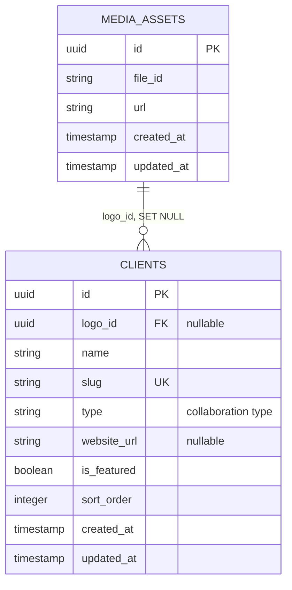

# Database Domain — Clients

Status: Draft

## Tujuan domain

`clients` menyimpan data partner/klien 180DC yang ditampilkan pada website, termasuk logo, tipe kolaborasi, website, featured flag, dan urutan tampilan.

Schema sumber: migration `2026_06_25_100008_create_clients_table`.

## Visualisasi database

## Aturan relasi dan data

- Satu client boleh tidak memiliki logo (`logo_id = null`).
- Satu `media_assets` dapat direferensikan oleh beberapa client karena tidak ada unique constraint pada `logo_id`.
- Jika media dihapus, `clients.logo_id` menjadi `null`.
- Jika client dihapus, record `media_assets` tidak ikut dihapus.
- `slug` wajib unique.
- `type` disimpan sebagai string dengan nilai aplikasi: `CASE_COLLABORATION`, `EVENT_COLLABORATION`, atau `MEDIA_PARTNER`.
- `is_featured` default `false`; `sort_order` default `0`.

## API yang sudah tersedia

Route berada di bawah `/api/clients`:

| Method | Endpoint | Akses |
|---|---|---|
| GET | `/api/clients` | Public |
| POST | `/api/clients` | Admin |
| PATCH | `/api/clients/{client}` | Admin |
| DELETE | `/api/clients/{client}` | Admin |

Response mengikuti envelope `status`, `message`, dan `data` yang digunakan controller API saat ini.

## Catatan implementasi

- Gunakan eager loading `logo` pada list/detail untuk menghindari N+1 query.
- Validasi `logo_id` harus memastikan asset ada di `media_assets`.
- Saat list public, filter dan sorting perlu membatasi data ke field yang diizinkan (`type`, `is_featured`, `sort_order`, `name`).
- Perubahan `slug` harus mengecualikan record client yang sedang di-update dari validasi unique.

