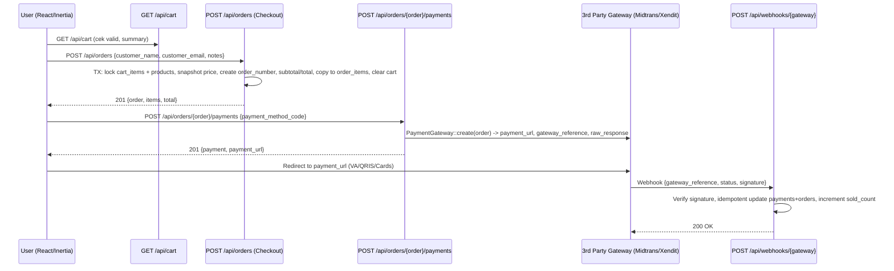
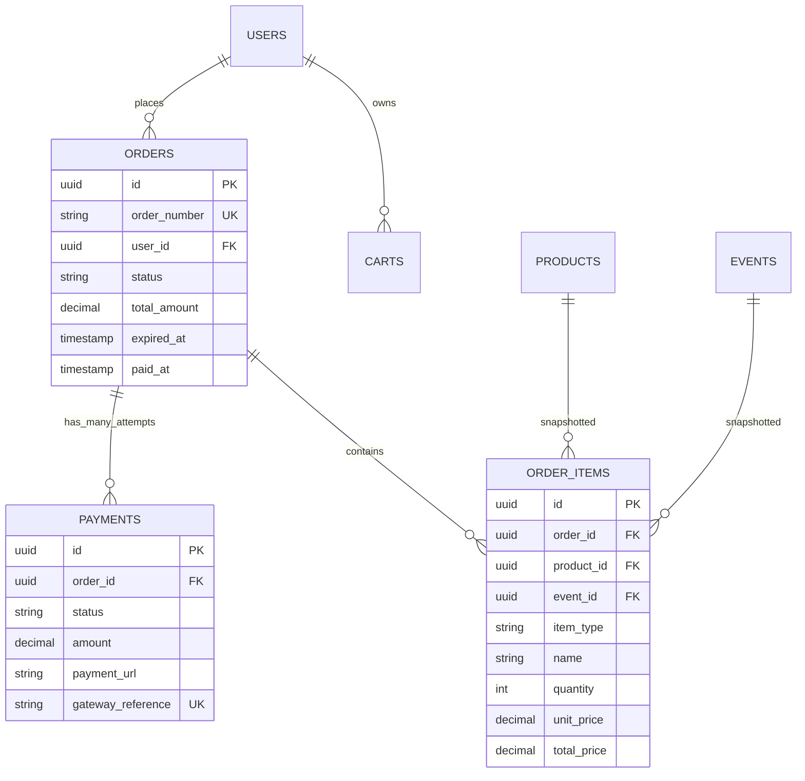

# Planning Backend API — Orders & Checkout

Status: **Approved** — Docker-native, Gateway-ready
Version: 2.0.0 | Stack: Laravel 13 + MySQL 8.4 + Docker Compose Watch | Env: `http://localhost:8080`
Depends on: `carts-api.md v2`, `cart-items-api.md v2` → Next: `payments-api.md v2`

## 1. Tujuan & Posisi di Flow E-commerce

`Orders` adalah **boundary** antara `Cart` (live, mutable) dan `Payments` (gateway, immutable). Saat user klik **Checkout**, sistem **freeze** semua `cart_items` menjadi `order_items` dengan snapshot harga — setelah itu cart dikosongkan, order tidak lagi terpengaruh perubahan harga produk.

**Alur lengkap (gateway-agnostic):**



**Kenapa terpisah `Orders` vs `Payments`?**
- 1 `Order` bisa punya banyak `Payment` attempt (retry jika expired/gagal) — `payments` 1:N ke `orders`.
- Gateway **hanya** tahu `Order` (amount + order_number) — tidak tahu `Cart`.
- `Order` harus bisa `paid` tanpa `Cart` (contoh: `event` direct order tanpa cart).

## 2. Schema Sumber

Migrations:
- `2026_06_25_100020_create_orders_table`
- `2026_06_25_100021_create_order_items_table`

```php
orders: id UUID PK, user_id UUID FK -> users SET NULL nullable,
        order_number STRING UNIQUE, // ORD-20260830-AB12CD (generate service)
        status STRING default pending, // pending|paid|cancelled|expired|failed
        customer_name STRING nullable, customer_email STRING nullable,
        subtotal_amount DECIMAL 15,2 default 0, total_amount DECIMAL 15,2 default 0,
        currency STRING default IDR, paid_at TIMESTAMP nullable, expired_at TIMESTAMP nullable,
        timestamps (created_at, updated_at)

order_items: id UUID PK, order_id FK -> orders CASCADE,
             product_id FK -> products SET NULL nullable,
             event_id FK -> events SET NULL nullable, // future: event ticketing
             item_type STRING (product|event), // discriminator
             name STRING, // snapshot title
             quantity INT default 1, unit_price DECIMAL 15,2, total_price DECIMAL 15,2,
             created_at TIMESTAMP useCurrent // no updated_at by design (immutable snapshot)
```

> **Catatan:** `order_items` tidak punya `updated_at` — by design snapshot tidak boleh di-update setelah create. Jika ada refund, buat `order_refunds` baru, jangan mutate.

### 2.1 Visualisasi ERD



## 3. Keputusan Domain (Lock)

| Keputusan | Detail |
|---|---|
| **Checkout = snapshot, bukan reference** | `order_items.unit_price` disalin dari `products.price` saat `POST /orders` dalam TX. Setelah itu perubahan `products.price` tidak mempengaruhi order. `name` juga snapshot `product.title`. |
| **Satu checkout mengosongkan cart** | `POST /api/orders` dalam 1 `DB::transaction` → `create Order + OrderItems` → `Cart::clear` → commit. Jika gagal di tengah, rollback total. |
| **Order number human-friendly** | Format `ORD-YYYYMMDD-XXXXXX` (6 alnum uppercase) via `OrderNumberService`. Unique index + retry on collision. |
| **Expiry** | `orders.expired_at = now + 24 hours` (config `orders.expiry_hours` default 24). `payments.expired_at` ikut gateway (misal Midtrans 24h, Xendit 24h, manual 24h). Scheduler `orders:expire` setiap jam. |
| **Status machine** | `pending -> paid -> completed` atau `pending -> cancelled|expired|failed`. `paid` hanya bisa via webhook `paid` (bukan manual `PATCH` user). `cancelled` hanya jika `status === pending` dan milik user. `expired` via scheduler. |
| **Digital vs Physical** | Tidak kurangi `stock` saat checkout — kurangi **saat payment `paid` webhook** (lihat `payments-api.md`). Checkout hanya validasi `quantity <= stock` (untuk yang valid saat checkout). |
| **Event direct order** | MVP: `POST /api/orders` bisa buat order tanpa cart — body `items: [{item_type: product|event, product_id|event_id, quantity}]`. Jika `item_type=product` tanpa `cart`, tetap snapshot langsung. Ini memungkinkan `event` checkout tanpa cart. |
| **Idempotency** | `POST /api/orders` support `Idempotency-Key` header (UUID v4) — simpan di `cache`/`orders.idempotency_key` (tambah kolom jika perlu) — cegah double order jika user double-click. |
| **Currency** | `IDR` only — gateway semua IDR. |

## 4. Perubahan Schema (Docker)

```bash
# 1. Tambah kolom/statue index jika belum
docker compose exec app php artisan make:migration add_indexes_and_expiry_to_orders --table=orders
# up():
# $table->index('user_id');
# $table->index('status');
# $table->index('order_number');
# $table->index('expired_at');
# $table->string('idempotency_key')->nullable()->unique(); // optional

docker compose exec app php artisan make:migration add_indexes_to_order_items --table=order_items
# up(): $table->index('order_id'); $table->index('product_id'); $table->index('event_id');

docker compose exec app php artisan migrate
docker compose exec mysql mysql -u180dc -p180dc -e "SHOW CREATE TABLE orders; SHOW CREATE TABLE order_items;" 180dc
```

## 5. Endpoint — Orders

Base: `/api/orders` — `auth:sanctum` untuk user, `auth:sanctum + admin` untuk admin.

| Method | Path | Akses | Tujuan |
|---|---|---|---|
| `POST` | `/api/orders` | User | **Checkout** — buat order dari cart (atau direct items) |
| `GET` | `/api/orders` | User | List my orders (paginated, filter status) |
| `GET` | `/api/orders/{order}` | User (owner) / Admin | Detail order + items + payments |
| `POST` | `/api/orders/{order}/cancel` | User (owner) | Cancel jika `pending` |
| `GET` | `/api/admin/orders` | Admin | List all orders (paginated, filter status, search order_number/email) |
| `PATCH` | `/api/admin/orders/{order}/status` | Admin | Update status (`paid` hanya via webhook — admin tidak bisa manual paid; bisa `completed|cancelled`) |

### 5.1 POST /api/orders — Checkout (Paling Kritis)

**Auth:** `Bearer token` wajib.

**Request body — Mode A: dari Cart (MVP, paling umum):**
```json
{
  "customer_name": "Misbahul",
  "customer_email": "misbah@example.com",
  "notes": "Tolong packing rapi",
  "payment_method_code": "manual_transfer"
}
```
- Jika `cart` kosong → 422 `Cart is empty`.
- `customer_name/email` default dari `auth()->user()` jika tidak dikirim.

**Request body — Mode B: Direct items (untuk event / buy-now tanpa cart):**
```json
{
  "customer_name": "Misbahul",
  "customer_email": "misbah@example.com",
  "items": [
    { "item_type": "product", "product_id": "uuid-product", "quantity": 2 },
    { "item_type": "event", "event_id": "uuid-event", "quantity": 1 }
  ]
}
```
- Jika `items` dikirim, **abaikan cart** — snapshot dari `items` tersebut.
- Validasi tiap item: `product_id` exists & `status=active` & `stock >= qty` (jika physical).

**Headers opsional:**
```
Idempotency-Key: 550e8400-e29b-41d4-a716-446655440000
```

**Logic `OrderService::checkout(User $user, array $data)` — dalam `DB::transaction`:**
```php
$cart = $this->cartService->getCurrentCart($user);
$sourceItems = $data['items'] ?? $cart->items()->with('product')->get()->map(...)->toArray();
if (empty($sourceItems)) throw ValidationException('Cart empty');

foreach ($sourceItems as $it) {
  $product = Product::lockForUpdate()->findOrFail($it['product_id']); // atau Event
  if ($product->status !== 'active') throw ConflictException('Product inactive');
  if ($product->type === 'physical' && $it['quantity'] > $product->stock) throw ConflictException('Insufficient stock');
  // kumpulkan snapshot
}

$orderNumber = $this->orderNumberService->generate(); // ORD-20260830-AB12CD dengan retry unique

$order = Order::create([
  'user_id' => $user->id,
  'order_number' => $orderNumber,
  'status' => 'pending',
  'customer_name' => $data['customer_name'] ?? $user->name,
  'customer_email' => $data['customer_email'] ?? $user->email,
  'subtotal_amount' => $subtotal, // sum unit*qty string
  'total_amount' => $subtotal, // + shipping/tax jika ada (MVP 0)
  'currency' => 'IDR',
  'expired_at' => now()->addHours(config('orders.expiry_hours', 24)),
]);

foreach ($snapshots as $s) {
  OrderItem::create([
    'order_id' => $order->id,
    'product_id' => $s['product_id'],
    'event_id' => $s['event_id'] ?? null,
    'item_type' => $s['item_type'],
    'name' => $s['name'], // product.title snapshot
    'quantity' => $s['quantity'],
    'unit_price' => $s['unit_price'], // string decimal
    'total_price' => bcmul($s['unit_price'], $s['quantity'], 2),
  ]);
}

// Kosongkan cart hanya jika source dari cart (bukan direct items)
if (empty($data['items'])) {
  $cart->items()->delete();
  $cart->touch();
}

return $order->load(['items']);
```

**Response 201:**
```json
{
  "status": "success",
  "message": "Order created successfully.",
  "data": {
    "id": "0196b0a1-...",
    "order_number": "ORD-20260830-AB12CD",
    "status": "pending",
    "customer_name": "Misbahul",
    "customer_email": "misbah@example.com",
    "currency": "IDR",
    "subtotal_amount": "300000.00",
    "total_amount": "300000.00",
    "expired_at": "2026-08-31T00:00:00Z",
    "paid_at": null,
    "items": [
      {
        "id": "0196b0a2-...",
        "item_type": "product",
        "name": "Kaos 180DC",
        "quantity": 2,
        "unit_price": "150000.00",
        "total_price": "300000.00",
        "product": { "id": "...", "slug": "kaos-180dc", "image": { "url": "..." } }
      }
    ],
    "created_at": "2026-08-30T00:00:00Z"
  }
}
```

**Error:**
- `401` unauthenticated
- `422` cart empty / items empty / `quantity` 0 / `product_id` invalid
- `409` product inactive / stock insufficient (`errors.quantity`)
- `409` idempotency conflict — jika `Idempotency-Key` sama dan order sudah ada, return order yang sama 200 (bukan 409)

### 5.2 GET /api/orders — List My Orders

**Query:** `?page=1&per_page=15&status=pending|paid|cancelled|expired&search=ORD-...&sort=created_at&direction=desc`

**Response 200 paginated:**
```json
{
  "status":"success",
  "data":[
    { "id":"...", "order_number":"ORD-...", "status":"pending","total_amount":"300000.00","item_count":2,"created_at":"..." }
  ],
  "meta": { "current_page":1,"last_page":3,"per_page":15,"total":42 }
}
```

### 5.3 GET /api/orders/{order}

- **Scope:** `where user_id = auth()->id()` — jika bukan owner dan bukan admin → 404 (bukan 403 untuk anti enumeration).
- Include `items` + `payments` (latest) + `expired_at` countdown.

### 5.4 POST /api/orders/{order}/cancel

- Hanya `status === pending` → `cancelled`. Jika `paid` → 409 `Cannot cancel paid order`.

### 5.5 Admin: GET /api/admin/orders, PATCH /api/admin/orders/{order}/status

- Admin tidak boleh manual `status=paid` — `paid` hanya via webhook. Admin bisa `completed` (fulfillment) atau `cancelled`.

## 6. Status Machine

```
                ┌─────────────┐
                │   pending   │◄── created via POST /api/orders
                └──────┬──────┘
         ┌─────────────┼──────────────┐
         │             │              │
    webhook paid  POST /cancel   scheduler expiry
         │             │              │
         ▼             ▼              ▼
      ┌──────┐   ┌───────────┐  ┌─────────┐
      │ paid │   │ cancelled │  │ expired │
      └─┬────┘   └───────────┘  └─────────┘
        │ PATCH admin
        ▼
   ┌───────────┐
   │ completed │ (fulfillment done)
   └───────────┘
   failed (gateway error) -> bisa retry payment
```

## 7. Transaksi, Lock & Idempotency

- **Lock order:** `Product::lockForUpdate()` saat snapshot untuk cegah oversell (2 checkout paralel product last stock 1 → salah satu harus 409).
- **Idempotency:** simpan `Idempotency-Key` di `cache` (Redis `database` store) dengan TTL 24h: `cache()->put("order:idemp:{$key}", $order->id, 86400)`. Jika key sama datang lagi, kembalikan order yang sama.
- **Order number collision:** retry 3x `generate()` jika `23000 duplicate order_number`.
- **Expired scheduler:** `app/Console/Commands/ExpirePendingOrders.php` → `Order::where('status','pending')->where('expired_at','<',now())->update(['status'=>'expired'])` — jalan via `docker compose exec app php artisan orders:expire` + cron `schedule:work`.

## 8. Rencana Implementasi (Docker-native)

1. **Migration indexes** — §4 `docker compose exec app php artisan migrate`
2. **Models** — `Order.php` (`HasUuids`, `fillable`, `casts total decimal:2`, `user()`, `items()`, `payments()`), `OrderItem.php` (no `updated_at`, `order()`, `product()`, `event()`)
3. **Service** — `OrderService` (`checkout`, `findByOrderNumber`, `cancel`, `expirePending`), `OrderNumberService` (generate `ORD-` + date + 6 alnum), bind di `AppServiceProvider`
4. **Requests** — `StoreOrderRequest` (`customer_name:string|max:255`, `customer_email:email`, `items: sometimes|array`, `items.*.item_type:in:product,event`, `items.*.quantity:1..99`), `CancelOrderRequest` (empty)
5. **Resources** — `OrderResource` (include `items` via `OrderItemResource`, `payments` via `PaymentResource` minimal, `is_expired`, `can_cancel`, `can_pay`), `OrderItemResource`
6. **Controller** — `OrderController` (`store`, `index`, `show`, `cancel`), `AdminOrderController` (`index`, `updateStatus`)
7. **Routes** `routes/api.php`:
   ```php
   Route::middleware('auth:sanctum')->group(function () {
       Route::post('/orders', [OrderController::class,'store']);
       Route::get('/orders', [OrderController::class,'index']);
       Route::get('/orders/{order}', [OrderController::class,'show']);
       Route::post('/orders/{order}/cancel', [OrderController::class,'cancel']);
       Route::post('/orders/{order}/payments', [PaymentController::class,'store']); // see payments-api.md
   });
   Route::prefix('admin')->middleware(['auth:sanctum','admin'])->group(function () {
       Route::get('/orders', [AdminOrderController::class,'index']);
       Route::patch('/orders/{order}/status', [AdminOrderController::class,'updateStatus']);
   });
   ```
8. **Scheduler** — `app/Console/Kernel.php` → `$schedule->command('orders:expire')->hourly();` + `docker compose exec app php artisan schedule:work` (di `docker-compose.yml` service `scheduler` jika ingin)
9. **Test (Docker)**:
   ```bash
   docker compose exec app php artisan make:test OrderCheckoutTest
   docker compose exec app php artisan test --filter=OrderCheckoutTest
   ```
   Cases: `checkout_from_cart_clears_cart_and_snapshots_price`, `checkout_empty_cart_422`, `checkout_product_inactive_409`, `checkout_insufficient_stock_409`, `checkout_idempotency_same_key_returns_same_order`, `user_cannot_see_other_user_order`, `cancel_pending_succeeds`, `cancel_paid_409`, `order_number_unique`, `expired_via_scheduler`.

## 9. Acceptance Criteria

- [ ] `POST /api/orders` dari cart berisi 2 items → `orders` 1 row + `order_items` 2 rows, `cart_items` 0, `total_amount` benar
- [ ] Ubah `products.price` setelah checkout → `order_items.unit_price` **tidak** berubah
- [ ] Double `POST /api/orders` dengan `Idempotency-Key` sama → 1 order, bukan 2
- [ ] `GET /api/orders/{id}` milik user lain → 404
- [ ] `POST /cancel` saat `paid` → 409
- [ ] Scheduler `orders:expire` → `pending` lewat `expired_at` jadi `expired`

## 10. Docker QA & Bruno

```bash
# Smoke checkout docker
TOKEN=$(curl -s -X POST http://localhost:8080/api/auth/login -H "Content-Type: application/json" -d '{"email":"user@test.com","password":"password"}' | jq -r .data.token)
curl -s http://localhost:8080/api/cart -H "Authorization: Bearer $TOKEN" | jq
curl -s -X POST http://localhost:8080/api/orders -H "Authorization: Bearer $TOKEN" -H "Content-Type: application/json" -H "Idempotency-Key: $(uuidgen)" -d '{"customer_name":"Test","customer_email":"test@test.com"}' | jq
# Bruno: docs/API/Orders/* (buat 5 file baru)
```

## 11. File Map

- Next: `docs/plan/backend/payments-api.md` (gateway, webhooks)
- Related: `carts-api.md`, `cart-items-api.md`
- Migration: `2026_06_25_100020_create_orders_table.php`, `2026_06_25_100021_create_order_items_table.php`
