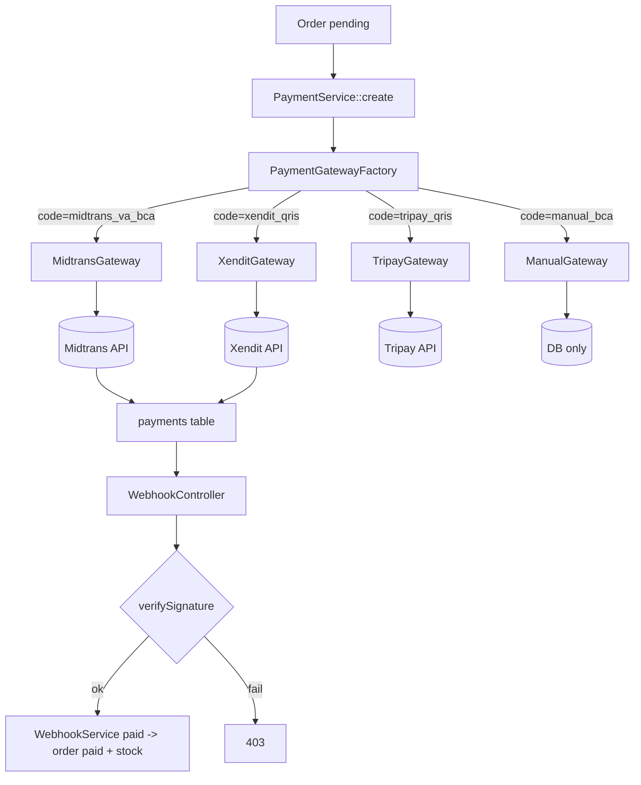

# Planning — Payment Gateway Integration (3rd Party)

Status: **Approved** — Docker-native, Gateway-agnostic
Version: 2.0.0 | Env: `localhost:8080` + Docker Compose Watch | Gateway: Midtrans / Xendit / Tripay / Manual

## 1. Tujuan

Menjamin `web-180dc-2026` bisa **ganti gateway tanpa ubah contract `Orders`/`Carts`**. Cukup tambah 1 class Gateway baru + 1 row `payment_methods` + 3 ENV. Semua business logic (`stock`, `order status`, `idempotency`) stay di `PaymentService`/`WebhookService`, bukan tersebar di controller gateway.

**MVP tanpa biaya:** `manual` gateway (transfer BCA) harus bisa full flow tanpa daftar Midtrans/Xendit — penting untuk Docker local & demo dosen.

## 2. Arsitektur — Strategy + Factory + Webhook



**Contract:**
```php
// app/Services/Payments/Contracts/PaymentGatewayInterface.php
interface PaymentGatewayInterface {
    /**
     * @return array{gateway_reference:string, payment_url:?string, raw_response:array, expired_at:Carbon}
     */
    public function createPayment(Order $order, Payment $payment, PaymentMethod $method): array;

    /** Optional: active status check (polling fallback jika webhook delay) */
    public function checkStatus(Payment $payment): array; // ['status'=> 'pending|paid|expired|failed']

    /** Parse webhook payload to normalized shape */
    public function parseWebhook(Request $request): array; // ['gateway_reference'=>, 'status'=>, 'amount'=>, 'paid_at'=>]

    public function verifySignature(Request $request): bool;
}
```

## 3. ENV & Docker Compose Spesifikasi (Update Wajib)

### 3.1 `.env.example` (commit) — tambah block:
```env
# --- Payments Gateway ---
PAYMENTS_TTL_HOURS=24
ORDERS_EXPIRY_HOURS=24

# Midtrans (https://dashboard.sandbox.midtrans.com)
MIDTRANS_SERVER_KEY=
MIDTRANS_CLIENT_KEY=
MIDTRANS_IS_PRODUCTION=false

# Xendit (https://dashboard.xendit.co)
XENDIT_API_KEY=
XENDIT_CALLBACK_TOKEN=

# Tripay (https://tripay.co.id)
TRIPAY_API_KEY=
TRIPAY_PRIVATE_KEY=
TRIPAY_MERCHANT_CODE=
TRIPAY_IS_PRODUCTION=false

# Manual (no keys needed)
```

### 3.2 `config/services.php` — tambah:
```php
'midtrans' => [
    'server_key' => env('MIDTRANS_SERVER_KEY'),
    'client_key' => env('MIDTRANS_CLIENT_KEY'),
    'is_production' => env('MIDTRANS_IS_PRODUCTION', false),
],
'xendit' => [
    'api_key' => env('XENDIT_API_KEY'),
    'callback_token' => env('XENDIT_CALLBACK_TOKEN'),
],
'tripay' => [
    'api_key' => env('TRIPAY_API_KEY'),
    'private_key' => env('TRIPAY_PRIVATE_KEY'),
    'merchant_code' => env('TRIPAY_MERCHANT_CODE'),
    'is_production' => env('TRIPAY_IS_PRODUCTION', false),
],
'payments' => [
    'ttl_hours' => env('PAYMENTS_TTL_HOURS', 24),
],
'orders' => [
    'expiry_hours' => env('ORDERS_EXPIRY_HOURS', 24),
],
```

### 3.3 `docker-compose.yml` — pass env ke service `app`:
```yaml
services:
  app:
    environment:
      - PAYMENTS_TTL_HOURS=${PAYMENTS_TTL_HOURS:-24}
      - MIDTRANS_SERVER_KEY=${MIDTRANS_SERVER_KEY:-}
      - MIDTRANS_CLIENT_KEY=${MIDTRANS_CLIENT_KEY:-}
      - MIDTRANS_IS_PRODUCTION=${MIDTRANS_IS_PRODUCTION:-false}
      - XENDIT_API_KEY=${XENDIT_API_KEY:-}
      - XENDIT_CALLBACK_TOKEN=${XENDIT_CALLBACK_TOKEN:-}
      - TRIPAY_API_KEY=${TRIPAY_API_KEY:-}
      - TRIPAY_PRIVATE_KEY=${TRIPAY_PRIVATE_KEY:-}
      - TRIPAY_MERCHANT_CODE=${TRIPAY_MERCHANT_CODE:-}
```
**Verifikasi Docker:**
```bash
docker compose config | grep -A2 MIDTRANS
docker compose exec app env | grep -E "MIDTRANS|XENDIT|TRIPAY|PAYMENTS"
docker compose restart app
docker compose logs app | grep -i payment
```

### 3.4 `Dockerfile` — jika pakai `curl` untuk gateway, pastikan `curl` + `ca-certificates` ada (sudah di `php:8.3-fpm` base). Tidak perlu ext baru.

## 4. Implementasi Per Gateway (Detail)

### 4.1 Factory

```php
// app/Services/Payments/PaymentGatewayFactory.php
class PaymentGatewayFactory {
    public function make(string $gateway): PaymentGatewayInterface {
        return match($gateway) {
            'midtrans' => app(MidtransGateway::class),
            'xendit' => app(XenditGateway::class),
            'tripay' => app(TripayGateway::class),
            'manual' => app(ManualGateway::class),
            default => throw new InvalidArgumentException("Unknown gateway $gateway"),
        };
    }
}
```

### 4.2 ManualGateway (No External Call, MVP)

```php
public function createPayment(Order $o, Payment $p, PaymentMethod $m): array {
    return [
        'gateway_reference' => 'MANUAL-'.$o->order_number.'-'.$p->id,
        'payment_url' => null, // frontend tampilkan VA manual
        'raw_response' => ['bank'=>'BCA','va'=>'1234567890','note'=>'Transfer sesuai total_amount'],
        'expired_at' => now()->addHours(config('payments.ttl_hours')),
    ];
}
public function verifySignature(Request $r): bool { return true; } // manual webhook via admin auth, bukan public
public function parseWebhook(Request $r): array { return ['gateway_reference'=>$r->gateway_reference,'status'=>$r->status]; }
```

### 4.3 MidtransGateway (Core API)

- **Create:** `POST https://api.sandbox.midtrans.com/v2/charge` — auth `Basic base64(server_key:)`, body `bank_transfer {bank: bca}` + `transaction_details {order_id: $payment->gateway_reference, gross_amount: $order->total_amount}`. Simpan `redirect_url` jika BCA VA, atau `permata_va_number`.
- **Signature:** `hash('sha512', $order_id.$status_code.$gross_amount.$server_key) === $r->signature_key`
- **Webhook:** `POST /api/webhooks/midtrans` body `{order_id, transaction_status: capture|settlement|pending|deny|expire, gross_amount, signature_key}` → map `settlement|capture` → `paid`.

**Docker test sandboxed:**
```bash
docker compose exec app php artisan tinker
>>> $g = app(App\Services\Payments\Gateways\MidtransGateway::class);
>>> // tidak hit API jika MIDTRANS_SERVER_KEY kosong — fallback ke mock
```

### 4.4 XenditGateway (Invoice API)

- **Create:** `POST https://api.xendit.co/v2/invoices` — auth `Basic base64(api_key:)`, body `{external_id: $order->order_number, amount: $order->total_amount, payer_email, invoice_duration: 86400}` → `invoice_url`, `id`.
- **Signature:** `header x-callback-token === config('services.xendit.callback_token')`
- **Webhook:** `{id, external_id, status: PENDING|PAID|EXPIRED, amount}` → map `PAID` → `paid`.

### 4.5 TripayGateway (Closed Payment)

- **Create:** `POST https://tripay.co.id/api/transaction/create` — `Signature: hash_hmac('sha256', $merchantCode.$merchantRef.$amount, $privateKey)`, body `method: QRIS, merchant_ref: $order->order_number, amount`. → `checkout_url`, `reference`.
- **Signature:** `hash_hmac('sha256', $rawJson, $privateKey)` vs `X-Callback-Signature`
- **Webhook:** `{reference, merchant_ref, status: PAID|EXPIRED}`.

## 5. Webhook Routing & Middleware

```php
// routes/api.php
Route::post('/webhooks/{gateway}', [WebhookController::class,'handle'])
    ->whereIn('gateway', ['midtrans','xendit','tripay','manual'])
    ->middleware('throttle:30,1') // tanpa auth
    ->name('webhooks.handle');
```

- `VerifyCsrfToken` sudah exclude `api/*`.
- IP allowlist optional: `middleware('webhook.ip:midtrans')` — simpan CIDR di `config/services.webhooks.ips`.

**Ngrok untuk Docker local (jika test webhook beneran):**
```bash
docker compose exec app php artisan ngrok:url # jika ada
# atau manual
ngrok http 8080
# set di Midtrans Dashboard: Notification URL = https://xxx.ngrok.io/api/webhooks/midtrans
```

## 6. Scheduler & Job (Docker)

```php
// app/Console/Commands/ExpirePendingPayments.php
Order::where('status','pending')->where('expired_at','<',now())->update(['status'=>'expired']);
Payment::where('status','pending')->where('expired_at','<',now())->update(['status'=>'expired']);
```

```bash
# Jalankan scheduler di Docker (opsi 1: di host cron, opsi 2: service scheduler)
docker compose exec app php artisan schedule:work &
# atau container terpisah di docker-compose.yml:
# scheduler: image: app, command: php artisan schedule:work, depends_on: [app]
docker compose logs -f scheduler
```

## 7. Error Handling & Observability (Docker)

- **Log:** `storage/logs/laravel.log` → `docker compose logs app | grep -E "payment|webhook|gateway"`
- **Raw response:** selalu simpan `payments.raw_response` + `payment_webhooks.payload` — untuk audit & replay.
- **Retry webhook:** jika `gateway` retry (5xx), `WebhookService` harus idempotent (cek `gateway_reference` + `is_processed`).
- **Alert:** jika `gateway create` 5xx → `Log::error('gateway.create.failed', ['gateway'=>$g,'order'=>$o->id])` + return `503` ke frontend.

## 8. Testing Plan (Docker)

```bash
# Unit: gateway signature
docker compose exec app php artisan test --filter=GatewaySignatureTest

# Feature: full flow tanpa hit gateway beneran (mock)
docker compose exec app php artisan test --filter=PaymentApiTest

# Isolate webhook idempotency
docker compose exec app php artisan make:test WebhookIdempotencyTest
docker compose exec app php artisan test --filter=WebhookIdempotencyTest
```

**Mock strategy (tanpa API key):**
- `.env` kosong `MIDTRANS_SERVER_KEY` → `MidtransGateway::create` return mock `payment_url=https://mock.midtrans.local/...`
- Test tetap 200 tanpa hit external — penting untuk CI Docker.

## 9. Frontend Contract (Docker Watch)

- `resources/js/features/cart/hooks/useCart.ts` → `GET /api/cart` (TanStack Query)
- `resources/js/features/checkout/hooks/useCheckout.ts` → `POST /api/orders` + `POST /orders/{order}/payments`
- `resources/js/features/payments/components/PaymentStatusPoller.tsx` → `useQuery(['payment', id], fetchPayment, {refetchInterval: 5000, enabled: status==='pending'})`
- Docker watch: `docker compose up --watch` → perubahan `resources/js/*` auto-sync ke container `node` + `npm run dev -- --host 0.0.0.0` via `docker/nginx/default.conf`.

## 10. Deployment Checklist (Staging/Prod Docker)

- [ ] `MIDTRANS_IS_PRODUCTION=true` + `TRIPAY_IS_PRODUCTION=true` untuk prod — jangan sandbox
- [ ] `docker compose -f docker-compose.prod.yml config` valid
- [ ] `docker compose exec app php artisan config:cache && route:cache` setelah env gateway terisi
- [ ] `payment_methods` seed jalan di prod (`docker compose exec app php artisan db:seed --class=PaymentMethodSeeder --force`)
- [ ] Webhook URL registered di dashboard Midtrans/Xendit (prod URL `https://180dc.id/api/webhooks/{gateway}`)
- [ ] `storage/framework/views` exclude dari git (sudah di `.gitignore`)
- [ ] Test manual: `curl POST /api/orders → POST /payments (xendit_qris) → curl webhook paid → GET /payments → paid + stock decrement`

## 11. Keputusan Open Questions (Lock)

- **Q: Pilih gateway mana dulu?** A: `manual` untuk MVP + 1 gateway berbayar `Xendit QRIS` (paling mudah, sandbox gratis). Midtrans/tripay tambah later tanpa ubah `orders`.
- **Q: Fee gateway?** A: `payments.raw_response` simpan `fee_amount` dari gateway, `orders.total_amount` tetap user-paid amount (fee ditanggung buyer atau seller — config `payments.fee_bearer`).
- **Q: Refund?** A: V2 — buat `refunds` table, jangan mutate `payments`.

## 12. File Map & Urutan PR

1. PR #1: `carts-api.md v2 + cart-items-api.md v2` (approved) → migration unique + `Cart/CartItem` models
2. PR #2: `orders-api.md v2` → `Order/OrderItem` + checkout
3. PR #3: `payments-api.md v2 + payment-gateway-integration.md` (ini) → `Payment*` + factory + webhooks + manual
4. PR #4: `XenditGateway` real (jika API key sudah ada) + scheduler + polling frontend

---

> **Catatan Docker-wajib:** Semua `php artisan`, `composer`, `npm`, `mysql` command di atas **harus** via `docker compose exec app|mysql|node` — jangan di host. Ini sesuai `AGENTS.md` + `docker-compose.yml` watch behavior. Jika `docker compose ps` unhealthy, fix dulu `docker compose logs` sebelum lanjut code.
