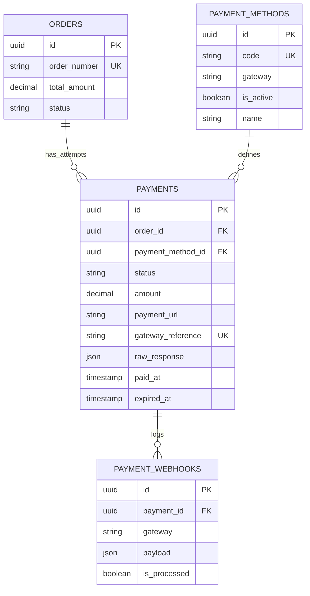

# Planning Backend API — Payments, Payment Methods & Webhooks (3rd Party Gateway)

Status: **Approved** — Docker-native, Gateway-agnostic, Production-ready
Version: 2.0.0 | Stack: Laravel 13 + MySQL 8.4 + Docker Compose Watch | Env: `http://localhost:8080`
Depends on: `orders-api.md v2` → Next: `payment-gateway-integration.md`

## 1. Tujuan & Prinsip Gateway-Agnostic

Memisahkan **bisnis** (`Orders`) dari **uang** (`Payments`) agar bisa plug-in gateway apapun tanpa ubah contract `Orders`. Satu `Order` bisa punya banyak `Payment` attempts (retry jika expired/gagal).

**Prinsip:**
- **Gateway abstraction:** Semua gateway (Midtrans, Xendit, Tripay, Manual Transfer) implement `PaymentGatewayInterface` → `create()`, `checkStatus()`, `parseWebhook()`, `verifySignature()`. `PaymentService` tidak `if gateway === midtrans` bertebaran.
- **Order tidak tahu gateway detail:** `PaymentService::create(order, method_code)` → panggil gateway → simpan `gateway_reference`, `payment_url`, `raw_response`.
- **Source of truth:** Status `paid` **hanya** via webhook (signed) — bukan via `PATCH` frontend. Frontend hanya polling `GET /payments/{id}`.
- **Idempotent webhook:** `gateway_reference` unique + `payment_webhooks.is_processed` + `payments.status` guard.

Schema sumber:
- `2026_06_25_100022_create_payment_methods_table`
- `2026_06_25_100023_create_payments_table`
- `2026_06_25_100024_create_payment_webhooks_table`

```php
payment_methods: id UUID PK, name STRING, code STRING UNIQUE, gateway STRING (midtrans|xendit|tripay|manual), is_active BOOL default true, timestamps
payments: id UUID PK, order_id FK -> orders CASCADE, payment_method_id FK -> payment_methods SET NULL nullable,
          status STRING default pending (pending|paid|failed|expired|cancelled),
          amount DECIMAL 15,2, payment_url STRING nullable, gateway_reference STRING nullable UNIQUE,
          raw_response JSON nullable, paid_at TIMESTAMP nullable, expired_at TIMESTAMP nullable, timestamps
payment_webhooks: id UUID PK, payment_id FK -> payments SET NULL nullable, gateway STRING, payload JSON, is_processed BOOL default false, created_at TIMESTAMP useCurrent
```

## 2. Visualisasi



## 3. Keputusan Domain (Lock)

| Keputusan | Detail | Alasan |
|---|---|---|
| **1 Order : N Payments** | User boleh `POST /orders/{order}/payments` berkali-kali (retry). Hanya 1 `pending` aktif — jika ada `pending` belum expired, reject atau cancel dulu. | UX: payment expired → buat baru tanpa buat order baru |
| **Amount = Order.total_amount** | `payments.amount` disalin dari `orders.total_amount` — tidak dari client. | Anti-tampering |
| **Expiry** | `payments.expired_at = now + gateway_ttl` (Midtrans 24h, Xendit 24h, Tripay 24h, Manual 24h) — config `payments.ttl_hours`. | Sama dengan order expiry, webhook lewat tetap 409 |
| **Status `paid` hanya via webhook** | `PaymentController@update` **tidak ada**. Status diubah hanya di `WebhookController@handle`. | Anti-fake paid dari frontend |
| **Signature verification** | Tiap gateway punya `verifySignature(request)` — Midtrans `SHA512(order_id+status_code+gross_amount+server_key)`, Xendit `x-callback-token`, Tripay `HMAC SHA256` | Keamanan |
| **Idempotency webhook** | Simpan `payment_webhooks` **sebelum** proses, cek `gateway_reference` + `payload hash` — jika duplikat event `paid` datang 2x, proses hanya 1x | At-least-once delivery |
| **Stock decrement** | `products.stock--`, `sold_count++` **hanya** saat `payments` transisi `pending -> paid` (di webhook). | Cart/checkout tidak kurangi stok |

## 4. Perubahan Schema (Docker)

```bash
docker compose exec app php artisan make:migration add_indexes_to_payments --table=payments
# up():
# $table->unique('gateway_reference', 'payments_gateway_reference_unique');
# $table->index('order_id');
# $table->index('status');
# $table->index('expired_at');
# $table->index('payment_method_id');

docker compose exec app php artisan make:migration add_indexes_to_payment_webhooks --table=payment_webhooks
# up(): $table->index('payment_id'); $table->index('gateway'); $table->index('is_processed');

docker compose exec app php artisan make:migration add_gateway_config_to_payment_methods --table=payment_methods
# optional: $table->json('config')->nullable(); // per-method config (fee, VA prefix)

docker compose exec app php artisan migrate
```

## 5. Endpoint — Payment Methods (Master Data)

Base: `/api/payment-methods` (public active) + `/api/admin/payment-methods` (admin CRUD)

| Method | Path | Akses | Tujuan |
|---|---|---|---|
| `GET` | `/api/payment-methods` | Public | List active methods (`is_active=true`) |
| `GET` | `/api/admin/payment-methods` | Admin | List all (filter `is_active`, `gateway`) |
| `POST` | `/api/admin/payment-methods` | Admin | Create method |
| `PATCH` | `/api/admin/payment-methods/{paymentMethod}` | Admin | Update |
| `DELETE` | `/api/admin/payment-methods/{paymentMethod}` | Admin | Delete (soft? MVP hard delete jika belum dipakai) |

**Seed default (wajib):**
```php
// database/seeders/PaymentMethodSeeder.php
[
  ['name'=>'Manual Transfer BCA','code'=>'manual_bca','gateway'=>'manual','is_active'=>true],
  ['name'=>'Midtrans VA BCA','code'=>'midtrans_va_bca','gateway'=>'midtrans','is_active'=>true],
  ['name'=>'Xendit QRIS','code'=>'xendit_qris','gateway'=>'xendit','is_active'=>true],
  ['name'=>'Tripay QRIS','code'=>'tripay_qris','gateway'=>'tripay','is_active'=>true],
]
```
Jalankan via Docker: `docker compose exec app php artisan db:seed --class=PaymentMethodSeeder`

**Response `GET /api/payment-methods`:**
```json
{
  "status":"success",
  "data":[
    { "id":"...", "name":"Manual Transfer BCA","code":"manual_bca","gateway":"manual","is_active":true },
    { "id":"...", "name":"Xendit QRIS","code":"xendit_qris","gateway":"xendit","is_active":true }
  ]
}
```

## 6. Endpoint — Payments (Create & Poll)

Base: `auth:sanctum`

| Method | Path | Akses | Tujuan |
|---|---|---|---|
| `POST` | `/api/orders/{order}/payments` | User (owner) | Create payment attempt untuk order `pending` |
| `GET` | `/api/payments/{payment}` | User (owner) / Admin | Poll status payment |
| `GET` | `/api/orders/{order}/payments` | User (owner) | List payments untuk order |
| `GET` | `/api/admin/payments` | Admin | List all payments (filter status, gateway, order_number) |
| `POST` | `/api/payments/{payment}/cancel` | User (owner) | Cancel pending payment (optional) |

### 6.1 POST /api/orders/{order}/payments — Create Payment

**Auth:** `Bearer token` wajib, `order.user_id === auth()->id()` atau admin.

**Request:**
```json
{
  "payment_method_code": "xendit_qris",
  "idempotency_key": "550e8400-..."
}
```
Rules `StorePaymentRequest`:
```php
'payment_method_code' => ['required','string','exists:payment_methods,code'],
'idempotency_key' => ['sometimes','uuid'],
```

**Validasi bisnis:**
- `orders.status === pending` — jika `paid|cancelled|expired` → 409
- `orders.expired_at > now` — jika lewat → 409 `Order expired`
- Jika ada `payments` lain `pending` dan `expired_at > now` → 409 `Payment already pending, cancel first or wait expiry` (atau auto-cancel previous)
- `payment_methods.is_active === true` → jika false → 422

**Logic `PaymentService::create(Order $order, string $methodCode)` dalam TX:**
```php
$method = PaymentMethod::where('code',$methodCode)->where('is_active',true)->firstOrFail();
$gateway = app(PaymentGatewayFactory::class)->make($method->gateway); // midtrans|xendit|manual

// Buat payment row dulu pending
$payment = Payment::create([
  'order_id' => $order->id,
  'payment_method_id' => $method->id,
  'status' => 'pending',
  'amount' => $order->total_amount, // dari order, bukan client
  'expired_at' => now()->addHours(config('payments.ttl_hours', 24)),
]);

// Panggil gateway
try {
  $result = $gateway->createPayment($order, $payment, $method);
  // $result = ['gateway_reference'=>..., 'payment_url'=>..., 'raw_response'=>..., 'expired_at'=>...]
  $payment->update([
    'gateway_reference' => $result['gateway_reference'],
    'payment_url' => $result['payment_url'],
    'raw_response' => $result['raw_response'],
    'expired_at' => $result['expired_at'] ?? $payment->expired_at,
  ]);
} catch (GatewayException $e) {
  $payment->update(['status'=>'failed','raw_response'=>['error'=>$e->getMessage()]]);
  throw new ServiceUnavailableException('Payment gateway error');
}

return $payment->load('method');
```

**Gateway `create` per provider:**
- **Manual:** `gateway_reference = MANUAL-{$order->order_number}-{$payment->id}`, `payment_url = null` (atau `route('payments.manual.show', $payment)`), `raw_response = {va_number: 123, bank: BCA}`.
- **Midtrans:** `POST https://api.sandbox.midtrans.com/v2/charge` dengan `server_key` dari `config/services.midtrans.server_key` (via Docker env `MIDTRANS_SERVER_KEY`). Return `redirect_url`.
- **Xendit:** `POST https://api.xendit.co/v2/invoices` dengan `api_key` via `XENDIT_API_KEY`. Return `invoice_url`.
- **Tripay:** `POST https://tripay.co.id/api/transaction/create` dengan `TRIPAY_API_KEY`.

**Response 201:**
```json
{
  "status":"success",
  "message":"Payment created.",
  "data":{
    "id":"0196b0b0-...",
    "order_id":"0196b0a1-...",
    "status":"pending",
    "amount":"300000.00",
    "currency":"IDR",
    "payment_url":"https://checkout.xendit.co/...",
    "gateway_reference":"xendit_abc123",
    "expired_at":"2026-08-31T00:00:00Z",
    "payment_method":{ "code":"xendit_qris","name":"Xendit QRIS","gateway":"xendit" }
  }
}
```
- Untuk `manual`, `payment_url` = `null`, frontend tampilkan `VA / Instruksi Transfer`.

**Error:** `404` order not yours, `409` order not pending/expired/has pending payment, `422` method invalid/inactive, `503` gateway error.

### 6.2 GET /api/payments/{payment} — Poll

Frontend poll setiap 5 detik sampai `paid|failed|expired`.

```json
{
  "status":"success",
  "data":{
    "id":"...", "order_id":"...", "status":"pending",
    "amount":"300000.00", "payment_url":"https://...", "gateway_reference":"...",
    "expired_at":"...", "paid_at":null
  }
}
```

## 7. Endpoint — Webhooks (Paling Sensitif)

| Method | Path | Akses | Tujuan |
|---|---|---|---|
| `POST` | `/api/webhooks/{gateway}` | Public (gateway IP + signature) | Handle notifikasi pembayaran |

**Supported `{gateway}` values:** `midtrans`, `xendit`, `tripay`, `manual` (manual webhook via admin confirm).

**Security:**
- `midtrans`: header `X-Midtrans-Signature` → verify `hash('sha512', $order_id.$status_code.$gross_amount.$server_key)`
- `xendit`: header `x-callback-token` === `XENDIT_CALLBACK_TOKEN` (env)
- `tripay`: header `X-Callback-Signature` HMAC SHA256
- Rate limit `throttle:30,1` + IP allowlist jika gateway kasih CIDR
- **Tidak pakai `auth:sanctum`** — public, tapi verified.

**Logic `WebhookController@handle(string $gateway, Request $request)` :**
```php
$gatewayImpl = app(PaymentGatewayFactory::class)->make($gateway);
if (!$gatewayImpl->verifySignature($request)) abort(403, 'Invalid signature');

// Simpan raw webhook dulu (audit)
$webhook = PaymentWebhook::create([
  'payment_id' => null, // isi setelah lookup
  'gateway' => $gateway,
  'payload' => $request->all(),
  'is_processed' => false,
]);

$parsed = $gatewayImpl->parseWebhook($request);
// $parsed = ['gateway_reference'=>..., 'status'=> 'paid|failed|expired', 'amount'=>..., 'paid_at'=>...]

$payment = Payment::where('gateway_reference',$parsed['gateway_reference'])->lockForUpdate()->first();
if (!$payment) { $webhook->update(['is_processed'=>false]); return response()->json(['status'=>'ignored'], 200); }

$webhook->update(['payment_id'=>$payment->id]);

// Idempotency: jika payment sudah paid, jangan proses lagi
if ($payment->status === 'paid') {
  $webhook->update(['is_processed'=>true]);
  return response()->json(['status'=>'ok'], 200);
}

DB::transaction(function () use ($payment,$parsed,$webhook) {
  if ($parsed['status'] === 'paid' && $payment->status === 'pending') {
    $payment->update(['status'=>'paid','paid_at'=> $parsed['paid_at'] ?? now(), 'raw_response'=> array_merge($payment->raw_response??[], ['webhook'=>$parsed])]);
    $order = $payment->order()->lockForUpdate()->first();
    $order->update(['status'=>'paid','paid_at'=>now()]);

    // Stock decrement + sold_count (hanya di sini!)
    foreach ($order->items as $item) {
      if ($item->item_type === 'product' && $item->product_id) {
        Product::where('id',$item->product_id)->decrement('stock', $item->quantity);
        Product::where('id',$item->product_id)->increment('sold_count', $item->quantity);
      }
      // event: increment attendees, dll (future)
    }
  } elseif (in_array($parsed['status'], ['failed','expired'])) {
    $payment->update(['status'=>$parsed['status']]);
    // order tetap pending — bisa retry payment
    if ($parsed['status'] === 'expired' && $payment->order->payments()->where('status','pending')->count() === 0) {
      // optional: expire order jika semua payments expired dan order expired_at lewat
    }
  }
  $webhook->update(['is_processed'=>true]);
});

return response()->json(['status'=>'ok']);
```

**Response:** selalu `200` untuk gateway (jika 500, gateway akan retry). Log error via `Log::error` + `docker compose logs app`.

## 8. Polling vs Webhook — Frontend Flow (Docker Watch)

```
Frontend (Inertia)  ----POST /orders---->  Order pending
      |   \
      |    ----POST /orders/{order}/payments (method_code=xendit_qris)----> Payment pending + payment_url
      |                                                               |
      |  window.location = payment_url (redirect Xendit)  <--atau iframe/QR modal
      |
      +--- polling GET /payments/{payment} every 5s (TanStack Query)
                      |
                      +--> webhook async --> DB paid --> poll returns paid --> navigate /orders/{order} success
```

- Jangan rely `redirect_url` callback query `?status=success` — itu bisa difake. **Polling server** adalah truth.
- Untuk `manual_transfer`: frontend upload bukti transfer → `POST /api/payments/{payment}/proof` (opsional) → admin confirm → `PATCH /admin/payments/{payment}/confirm` → trigger same `paid` logic.

## 9. Manual Transfer (MVP tanpa gateway berbayar)

Jika belum daftar Midtrans/Xendit, flow tetap sama dengan `gateway=manual`:
- `payment_url = null`, `gateway_reference = MANUAL-xxx`
- Frontend tampilkan: `Bank BCA 1234567890 a.n. 180DC, Amount IDR 300.000, Order ORD-...`
- User upload bukti → `POST /api/payments/{payment}/proof` (upload ke ImageKit via `AdminMediaService`) → admin `POST /api/admin/payments/{payment}/confirm` → webhook internal `paid`.
- Ini memungkinkan testing full flow **tanpa API key gateway** — penting untuk Docker local.

## 10. Rencana Implementasi (Docker-native)

1. **Migrations indexes** — §4 `docker compose exec app php artisan migrate`
2. **Seeder** — `PaymentMethodSeeder` + `docker compose exec app php artisan db:seed --class=PaymentMethodSeeder`
3. **Config** — `config/services.php` tambah:
   ```php
   'midtrans' => ['server_key'=>env('MIDTRANS_SERVER_KEY'),'is_production'=>env('MIDTRANS_IS_PRODUCTION', false), 'client_key'=>env('MIDTRANS_CLIENT_KEY')],
   'xendit' => ['api_key'=>env('XENDIT_API_KEY'),'callback_token'=>env('XENDIT_CALLBACK_TOKEN')],
   'tripay' => ['api_key'=>env('TRIPAY_API_KEY'),'private_key'=>env('TRIPAY_PRIVATE_KEY'),'merchant_code'=>env('TRIPAY_MERCHANT_CODE')],
   'payments' => ['ttl_hours'=>env('PAYMENTS_TTL_HOURS',24)],
   ```
   + `.env.example` tambah 7 vars + `docker-compose.yml` pass env ke `app`.
4. **Interface & Factory:**
   - `app/Services/Payments/Contracts/PaymentGatewayInterface.php` (`create`, `checkStatus`, `parseWebhook`, `verifySignature`)
   - `app/Services/Payments/Gateways/MidtransGateway.php`, `XenditGateway.php`, `TripayGateway.php`, `ManualGateway.php`
   - `app/Services/Payments/PaymentGatewayFactory.php`
5. **Services:** `PaymentService` (`create`, `cancel`, `expire`), `WebhookService`
6. **Models:** `PaymentMethod`, `Payment`, `PaymentWebhook` (HasUuids, casts, relations)
7. **Requests/Resources:** `StorePaymentRequest`, `PaymentResource`, `PaymentMethodResource`
8. **Controllers:** `PaymentController`, `AdminPaymentMethodController`, `AdminPaymentController`, `WebhookController`
9. **Routes** `routes/api.php` (lihat §6 & §7) + `Route::post('/webhooks/{gateway}', [WebhookController::class,'handle'])->withoutMiddleware('auth')` dengan `throttle:30,1`.
10. **Scheduler** `app/Console/Commands/ExpirePendingPayments.php` (`status pending + expired_at < now => expired`) + `Kernel@hourly`.
11. **Test Docker:**
    ```bash
    docker compose exec app php artisan make:test PaymentGatewayTest --unit
    docker compose exec app php artisan make:test PaymentApiTest
    docker compose exec app php artisan test --filter=Payment
    ```
    Cases: `create_payment_from_pending_order`, `create_second_pending_409`, `create_for_paid_order_409`, `webhook_paid_updates_order_and_stock`, `webhook_duplicate_is_idempotent`, `webhook_invalid_signature_403`, `poll_returns_pending_then_paid`, `manual_flow_confirm_by_admin`.

## 11. Error Contract

| Status | Trigger |
|---|---|
| `200` | Poll success, webhook ok |
| `201` | Payment created |
| `401` | Unauthenticated |
| `403` | Webhook bad signature |
| `404` | Order/payment not found / not owned |
| `409` | Order not pending, has pending payment, order expired |
| `422` | method_code invalid/inactive |
| `503` | Gateway timeout/error |

## 12. Acceptance Criteria

- [ ] `GET /api/payment-methods` public hanya return `is_active=true`
- [ ] `POST /orders/{order}/payments` dengan order `pending` → `payments` pending + `gateway_reference` terisi + `payment_url` (atau null untuk manual)
- [ ] `POST /orders/{order}/payments` kedua dengan `pending` aktif → 409
- [ ] `POST /webhooks/xendit` dengan `x-callback-token` salah → 403
- [ ] `POST /webhooks/xendit` dengan `status=paid` → `payments.status=paid`, `orders.status=paid`, `products.stock` berkurang `order_items.quantity`, `payment_webhooks.is_processed=true`
- [ ] Kirim webhook `paid` duplikat 2x → `stock` hanya berkurang 1x (idempotent)
- [ ] Poll `GET /payments/{id}` setelah webhook → `paid`
- [ ] Expo `manual` flow: create → `payment_url null` → admin confirm → paid + stock decrement

## 13. Docker QA & ENV

```bash
# ENV (.env, jangan commit)
MIDTRANS_SERVER_KEY=SB-Mid-server-xxx
MIDTRANS_CLIENT_KEY=SB-Mid-client-xxx
MIDTRANS_IS_PRODUCTION=false
XENDIT_API_KEY=xnd_development_xxx
XENDIT_CALLBACK_TOKEN=callback_xxx
PAYMENTS_TTL_HOURS=24

# Pass ke docker-compose.yml
# app: environment: - MIDTRANS_SERVER_KEY=${MIDTRANS_SERVER_KEY} ...

# Test webhook local tanpa gateway (manual curl)
docker compose exec app php artisan tinker
# atau curl
curl -X POST http://localhost:8080/api/webhooks/xendit \
  -H "x-callback-token: $XENDIT_CALLBACK_TOKEN" \
  -H "Content-Type: application/json" \
  -d '{"external_id":"ORD-20260830-AB12CD","status":"PAID","id":"xendit_abc123"}' | jq
docker compose logs -f app | grep webhook
docker compose exec mysql mysql -u180dc -p180dc -e "SELECT status,gateway_reference FROM payments;" 180dc
```

## 14. Bruno

```
docs/API/Payment Methods/List Payment Methods.yml
docs/API/Payment Methods/Admin List Payment Methods.yml
docs/API/Payments/Create Payment.yml
docs/API/Payments/Poll Payment.yml
docs/API/Webhooks/Xendit Webhook.yml
docs/API/environments/Local.yml — tambah payment_id, payment_url, gateway_reference
```

## 15. File Map

- Related: `orders-api.md` (checkout) → `payments-api.md` (ini) → `payment-gateway-integration.md` (next detail per gateway)
- Migrations: `100022/23/24_create_*`
